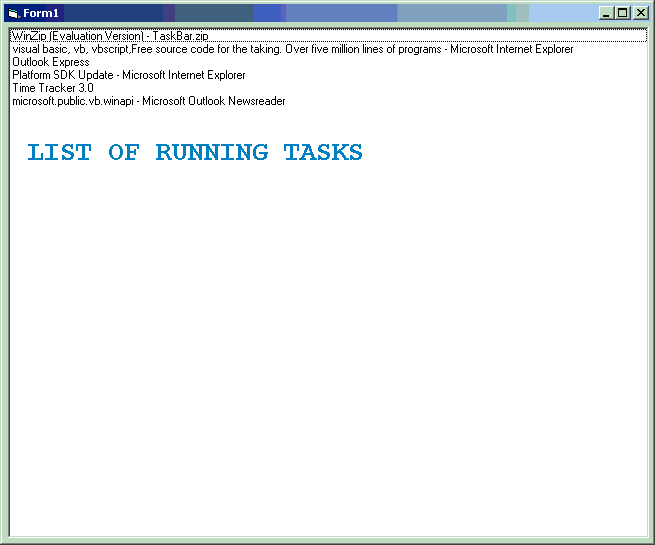

<div align="center">

## Task Listing using ShellHookProc


</div>

### Description

PLEASE DO PROVIDE FEEDBACK. I got another undocumented api call "ShellHookProc" which is exported from

shell32.dll can be used to set system wide shell hook and get various shell

related notifications like window created , window destroyed , and window

activated. Attached to this article is the working code to implement this

API. it is tested under my win2k and act as microsoft windows taskmanager

list. but the problem is that it works as long as windows "explorer.exe" is

running and fail to work if i register it as a shell in the registery and

load at startup, can anyone tell me the way to get this working in that

condition too. please help me out as soon as possible.
 
### More Info
 


<span>             |<span>
---                |---
**Submitted On**   |2004-06-23 21:46:44
**By**             |[V2](https://github.com/Planet-Source-Code/PSCIndex/blob/master/ByAuthor/v2.md)
**Level**          |Advanced
**User Rating**    |5.0 (10 globes from 2 users)
**Compatibility**  |VB 6\.0
**Category**       |[Windows API Call/ Explanation](https://github.com/Planet-Source-Code/PSCIndex/blob/master/ByCategory/windows-api-call-explanation__1-39.md)
**World**          |[Visual Basic](https://github.com/Planet-Source-Code/PSCIndex/blob/master/ByWorld/visual-basic.md)
**Archive File**   |[Task\_Listi1761476242004\.zip](https://github.com/Planet-Source-Code/v2-task-listing-using-shellhookproc__1-54567/archive/master.zip)

### API Declarations

```
'Windows API
Declare Function CallWindowProc Lib "user32" Alias "CallWindowProcA" (ByVal lpPrevWndFunc As Long, ByVal hWnd As Long, ByVal msg As Long, ByVal wParam As Long, ByVal lParam As Long) As Long
Declare Function EnumWindows Lib "user32" (ByVal lpfn As Long, ByVal lParam As Long) As Long
Declare Function GetProcAddress Lib "kernel32" (ByVal hModule As Long, ByVal lpProcName As String) As Long
Declare Function GetWindowText Lib "user32" Alias "GetWindowTextA" (ByVal hWnd As Long, ByVal lpString As String, ByVal cch As Long) As Long
Declare Function IsWindowVisible Lib "user32" (ByVal hWnd As Long) As Long
Declare Function LoadLibrary Lib "kernel32" Alias "LoadLibraryA" (ByVal lpLibFileName As String) As Long
Declare Function RegisterWindowMessage Lib "user32" Alias "RegisterWindowMessageA" (ByVal lpString As String) As Long
Declare Function SetWindowsHookEx Lib "user32" Alias "SetWindowsHookExA" (ByVal idHook As Long, ByVal lpfn As Long, ByVal hmod As Long, ByVal dwThreadId As Long) As Long
Declare Function SetWindowLong Lib "user32" Alias "SetWindowLongA" (ByVal hWnd As Long, ByVal nIndex As Long, ByVal dwNewLong As Long) As Long
Declare Function GetParent Lib "user32" (ByVal hWnd As Long) As Long
Declare Function GetWindow Lib "user32" (ByVal hWnd As Long, ByVal wCmd As Long) As Long
Declare Function GetWindowLong Lib "user32" Alias "GetWindowLongA" (ByVal hWnd As Long, ByVal nIndex As Long) As Long
Public Declare Function RegisterShellHook Lib "Shell32" Alias "#181" (ByVal hWnd As Long, ByVal nAction As Long) As Long
'Undocumented (at least that I could find) Windows API.
' Use with caution
Declare Function RegisterShellHookWindow Lib "user32" (ByVal hWnd As Long) As Long
'Constants for Windows API
Public Const HSHELL_WINDOWCREATED = 1
Public Const HSHELL_WINDOWDESTROYED = 2
Public Const HSHELL_ACTIVATESHELLWINDOW = 3
Public Const HSHELL_WINDOWACTIVATED = 4
Public Const HSHELL_GETMINRECT = 5
Public Const HSHELL_REDRAW = 6
Public Const HSHELL_TASKMAN = 7
Public Const HSHELL_LANGUAGE = 8
Public Const WM_NCDESTROY = &H82
Public Const GWL_WNDPROC = -4
Public Const WH_SHELL = 10
Public Const WH_CBT As Long = 5
Public Const GW_OWNER = 4
Public Const GWL_EXSTYLE = (-20)
Public Const WS_EX_TOOLWINDOW = &H80
Public Const WS_EX_APPWINDOW = &H40000
Public Const RSH_DEREGISTER = 0
Public Const RSH_REGISTER = 1
Public Const RSH_REGISTER_PROGMAN = 2
Public Const RSH_REGISTER_TASKMAN = 3
```


